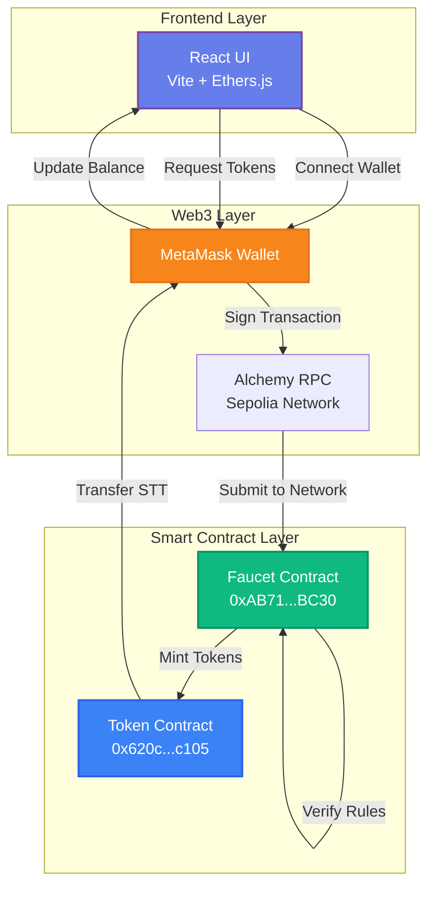
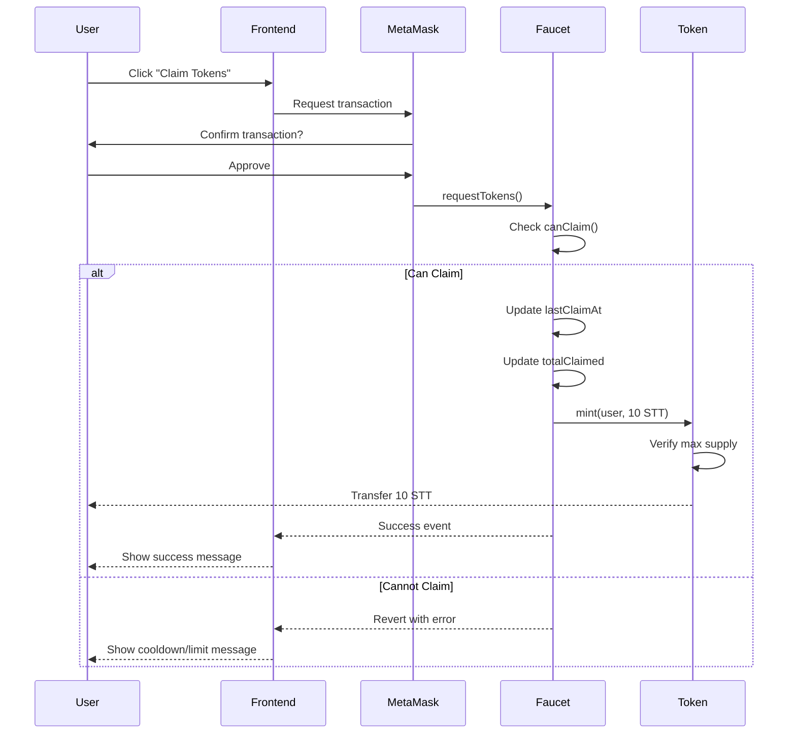
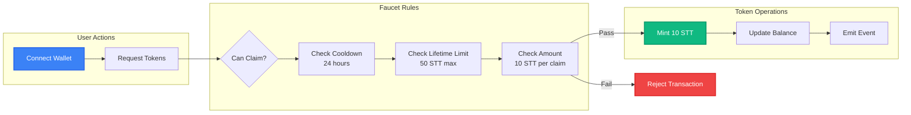

# 🚰 Sepolia Token Faucet - ERC-20 DApp

A professional decentralized application (DApp) deployed on the Sepolia Testnet that allows users to claim ERC-20 tokens (STT) for testing purposes. Features strict rate limiting with cooldowns and lifetime caps to prevent abuse.

---

## 🚀 Live Deployment & Verification

The smart contracts are deployed and verified on the Sepolia Testnet:

- **🔹 Token Contract:** [0x620c51860D2F639759fEe7C822681F6a54A0c105](https://sepolia.etherscan.io/address/0x620c51860D2F639759fEe7C822681F6a54A0c105#code)
- **🔹 Faucet Contract:** [0xAB71415ECD68551FFfcE0257d923d92B5256BC30](https://sepolia.etherscan.io/address/0xAB71415ECD68551FFfcE0257d923d92B5256BC30#code)

---

## 🏗 Architecture & Workflow

### System Architecture



### Token Claim Flow



### Smart Contract Interaction



---

## ✨ Key Features

### Smart Contract Features
- **ERC-20 Token Standard:** Fully compliant implementation
- **Automated Minting:** Faucet mints tokens on demand
- **Access Control:** Only faucet can mint tokens
- **Supply Cap:** Maximum 1,000,000 STT tokens

### Rate Limiting System
- **⏰ Cooldown Period:** 24 hours between claims
- **💧 Claim Amount:** 10 STT tokens per request
- **🎯 Lifetime Cap:** 50 STT maximum per wallet
- **🔒 Abuse Prevention:** Multiple validation checks

### Frontend Features
- **Modern UI/UX:** White and blue gradient theme
- **Real-time Updates:** Live balance and limit tracking
- **Wallet Integration:** Seamless MetaMask connection
- **Status Indicators:** Clear success/error messages
- **Responsive Design:** Works on all devices

---

## 🛠 Tech Stack

| Layer | Technology |
|-------|-----------|
| **Smart Contracts** | Solidity 0.8.20, Hardhat, OpenZeppelin |
| **Frontend** | React 18, Vite, Ethers.js v6 |
| **Styling** | Custom CSS with gradients & animations |
| **Network** | Sepolia Testnet |
| **RPC Provider** | Alchemy |
| **Wallet** | MetaMask |

---

## 📊 Contract Details

### Token Contract (STT)

```solidity
Name: SepoliaTestToken
Symbol: STT
Decimals: 18
Max Supply: 1,000,000 STT
Address: 0x620c51860D2F639759fEe7C822681F6a54A0c105
```

### Faucet Contract

```solidity
Faucet Amount: 10 STT
Cooldown Time: 24 hours (86400 seconds)
Max Claim Amount: 50 STT per wallet
Address: 0xAB71415ECD68551FFfcE0257d923d92B5256BC30
```

---

## ⚙️ Setup & Installation

### Prerequisites

- Node.js (v16 or higher)
- MetaMask wallet
- Sepolia testnet ETH (for gas fees)

### Option 1: Clone and Run Locally

```bash
# Clone the repository
git clone https://github.com/chdsssbaba/erc-d-app.git
cd erc-d-app

# Install frontend dependencies
cd frontend
npm install

# Start development server
npm run dev
```

The application will be accessible at `http://localhost:5173`

### Option 2: Deploy Your Own Contracts

```bash
# Install contract dependencies
cd contracts
npm install

# Configure environment
cp .env.example .env
# Edit .env with your credentials

# Deploy to Sepolia
npx hardhat run scripts/deploy.js --network sepolia
```

---

## 📸 Screenshots

### Connected Wallet - Success State


### Transaction Processing


### Wallet Connection


### MetaMask Transaction


---

## 🎯 How to Use

### Step 1: Get Sepolia ETH
Get free Sepolia testnet ETH from:
- [Alchemy Sepolia Faucet](https://www.alchemy.com/faucets/ethereum-sepolia)
- [Sepolia PoW Faucet](https://sepolia-faucet.pk910.de/)

### Step 2: Connect Wallet
1. Open the application
2. Click "Connect Wallet"
3. Approve MetaMask connection

### Step 3: Claim Tokens
1. Click "Claim 10 STT Tokens"
2. Confirm transaction in MetaMask
3. Wait for confirmation
4. Check your updated balance

### Step 4: View on Etherscan
- Check your token balance on [Sepolia Etherscan](https://sepolia.etherscan.io/)
- View transaction history
- Verify contract interactions

---

## 🔐 Security Features

- **Access Control:** Only authorized faucet can mint
- **Rate Limiting:** Prevents spam and abuse
- **Supply Cap:** Maximum token limit enforced
- **Cooldown System:** Time-based claim restrictions
- **Lifetime Limits:** Per-wallet maximum claims

---

## 📁 Project Structure

```
erc-d-app/
├── contracts/
│   ├── contracts/
│   │   ├── Token.sol              # ERC-20 token implementation
│   │   └── TokenFaucet.sol        # Faucet logic with rate limiting
│   ├── scripts/
│   │   └── deploy.js              # Deployment script
│   ├── test/
│   │   └── Lock.js                # Test files
│   └── hardhat.config.js          # Hardhat configuration
│
├── frontend/
│   ├── src/
│   │   ├── App.jsx                # Main React component
│   │   ├── App.css                # Styling
│   │   └── main.jsx               # Entry point
│   ├── public/
│   └── index.html
│
├── screenshots/                    # Application screenshots
├── README.md                       # This file
└── .gitignore                      # Git ignore rules
```

---

## 🧪 Testing

### Manual Testing Checklist

- ✅ Connect MetaMask wallet
- ✅ Claim tokens successfully
- ✅ Verify cooldown period works
- ✅ Check lifetime limit enforcement
- ✅ Test with multiple wallets
- ✅ Verify balance updates

### Automated Tests

```bash
cd contracts
npx hardhat test
```

---

## 🌐 Network Information

| Parameter | Value |
|-----------|-------|
| **Network** | Sepolia Testnet |
| **Chain ID** | 11155111 |
| **RPC URL** | https://eth-sepolia.g.alchemy.com/v2/... |
| **Block Explorer** | https://sepolia.etherscan.io |
| **Currency** | SepoliaETH (Test ETH) |

---

## 📜 Smart Contract Functions

### Token Contract

```solidity
// View Functions
balanceOf(address account) → uint256
totalSupply() → uint256
allowance(address owner, address spender) → uint256

// Write Functions (Faucet Only)
mint(address to, uint256 amount)
setFaucetAddress(address _faucet)
```

### Faucet Contract

```solidity
// Write Functions
requestTokens()

// View Functions
canClaim(address user) → bool
remainingAllowance(address user) → uint256
lastClaimAt(address user) → uint256
totalClaimed(address user) → uint256
```

---

## 🚀 Deployment Information

**Deployed On:** Sepolia Testnet  
**Deployment Date:** January 2026  
**Network:** Ethereum Sepolia  
**Gas Used:** ~2.5M gas  

**Contract Addresses:**
- Token: `0x620c51860D2F639759fEe7C822681F6a54A0c105`
- Faucet: `0xAB71415ECD68551FFfcE0257d923d92B5256BC30`

---

## 🔌 Evaluation Interface (window.__EVAL__)

The application exposes a programmatic interface for automated testing and evaluation. All methods are available on the global `window.__EVAL__` object.

### Available Methods

#### connectWallet()
Connects to the user's Web3 wallet and returns the connected address.
```javascript
const address = await window.__EVAL__.connectWallet();
// Returns: "0x742d35Cc6634C0532925a3b844Bc9e7595f0bEb"
```

#### requestTokens()
Requests tokens from the faucet and returns the transaction hash.
```javascript
const txHash = await window.__EVAL__.requestTokens();
// Returns: "0x123abc..."
```

#### getBalance(address)
Gets the token balance for a specific address.
```javascript
const balance = await window.__EVAL__.getBalance("0x742d35...");
// Returns: "10000000000000000000" (in wei, 10 tokens)
```

#### canClaim(address)
Checks if an address is eligible to claim tokens.
```javascript
const eligible = await window.__EVAL__.canClaim("0x742d35...");
// Returns: true or false
```

#### getRemainingAllowance(address)
Gets the remaining claimable amount for an address.
```javascript
const remaining = await window.__EVAL__.getRemainingAllowance("0x742d35...");
// Returns: "40000000000000000000" (in wei, 40 tokens remaining)
```

#### getContractAddresses()
Gets the deployed contract addresses.
```javascript
const addresses = await window.__EVAL__.getContractAddresses();
// Returns: { token: "0x620c51...", faucet: "0xAB7141..." }
```

### Return Types
- Addresses: `string` (hex format with 0x prefix)
- Balances/Amounts: `string` (wei format, use ethers.formatEther() to convert)
- Transaction Hashes: `string` (hex format with 0x prefix)
- Booleans: `boolean` (true/false)
- Errors: Throws Error with descriptive message

### Usage Example
```javascript
// Complete workflow example
try {
  // Connect wallet
  const userAddress = await window.__EVAL__.connectWallet();
  console.log("Connected:", userAddress);
  
  // Check if can claim
  const canClaim = await window.__EVAL__.canClaim(userAddress);
  console.log("Can claim:", canClaim);
  
  if (canClaim) {
    // Request tokens
    const txHash = await window.__EVAL__.requestTokens();
    console.log("Transaction:", txHash);
    
    // Check new balance
    const balance = await window.__EVAL__.getBalance(userAddress);
    console.log("New balance:", balance);
  }
  
  // Check remaining allowance
  const remaining = await window.__EVAL__.getRemainingAllowance(userAddress);
  console.log("Remaining:", remaining);
  
} catch (error) {
  console.error("Error:", error.message);
}
```

---

## 🤝 Contributing

This is a personal project for educational purposes. Feel free to fork and modify for your own use.

---

## 📄 License

This project is open-source and available under the MIT License.

---

## 🔗 Links

- **Repository:** [github.com/chdsssbaba/erc-d-app](https://github.com/chdsssbaba/erc-d-app)
- **Token Contract:** [Sepolia Etherscan](https://sepolia.etherscan.io/address/0x620c51860D2F639759fEe7C822681F6a54A0c105)
- **Faucet Contract:** [Sepolia Etherscan](https://sepolia.etherscan.io/address/0xAB71415ECD68551FFfcE0257d923d92B5256BC30)

---

## 📞 Support

For issues or questions:
1. Check the [Sepolia Etherscan](https://sepolia.etherscan.io/) for transaction status
2. Ensure you have Sepolia ETH for gas fees
3. Verify you're connected to Sepolia network in MetaMask
